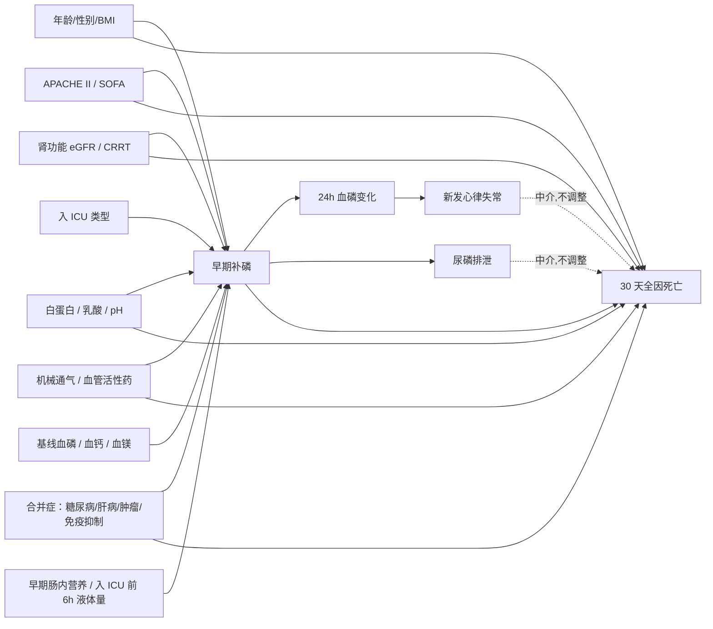

# 因果图（DAG，模拟）

> 示例项目模拟产物。节点命名与 22 个预设协变量对应；虚框表示不调整的中介变量。

```mermaid
graph LR
  A[年龄/性别/BMI] --> X[早期补磷]
  B[入 ICU 类型] --> X
  C[APACHE II / SOFA] --> X
  D[基线血磷 / 血钙 / 血镁] --> X
  E[肾功能 eGFR / CRRT] --> X
  F[白蛋白 / 乳酸 / pH] --> X
  G[机械通气 / 血管活性药] --> X
  H[合并症：糖尿病/肝病/肿瘤/免疫抑制] --> X
  I[早期肠内营养 / 入 ICU 前 6h 液体量] --> X
  A --> Y[30 天全因死亡]
  C --> Y
  E --> Y
  F --> Y
  G --> Y
  H --> Y
  X --> M1[24h 血磷变化]
  X --> M2[尿磷排泄]
  M1 --> M3[新发心律失常]
  X --> Y
  M2 -.中介,不调整.-> Y
  M3 -.中介,不调整.-> Y
```

## 调整集

- 调整：A–I 共 22 个基线协变量（见方案第 2 节）。
- 不调整：M1、M2、M3（时间零点后变量，中介或对撞）。
- 未测量混杂：补磷临床触发原因（医师主观判断）、营养支持细节；计划用 E-value 量化稳健性。
